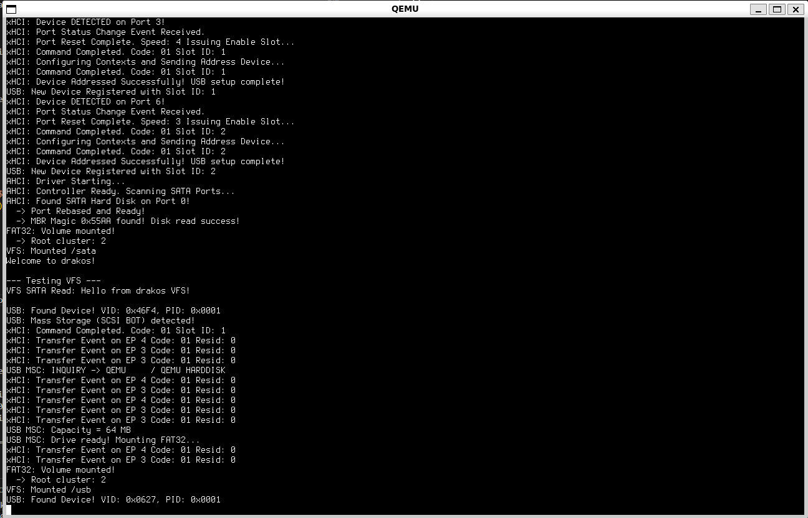

# drakos

Welcome to **drakos**! 🎮

drakos is an open-source, bare-metal operating system built from scratch in C++. 

## 🎯 Our Vision

drakos aims to turn a PC into a dedicated gaming machine by minimizing OS overhead and removing everything not required for gameplay.

The goal is not to replace desktop operating systems, but to build a console-like environment on standard PC hardware.

## 🚀 The Journey So Far

We are building this from the absolute ground up! Right now, the foundation is coming together, but we are making the hard architectural choices now (like ditching legacy hardware) to ensure a faster gaming experience later.

## 🤝 Contribution

Right now, drakos is a passionate project driven by a very small core team (it's mostly just me right now!), and the road ahead is massive. 

If you love low-level programming, graphics engines, or just want to be part of building something crazy and ambitious, **I need your help!**

We are especially looking for contributors who can help with:
- **USB Stack Development (xHCI):** Getting Xbox, PlayStation, and generic Bluetooth controllers to talk directly to our kernel.
- **2D/3D Graphics & Compositing:** Pushing pixels to the screen as fast as possible without a bloated desktop environment.
- **Audio Drivers:** Because gaming without sound isn't gaming.
- **Testing & Ideas:** Running drakos on real hardware, finding bugs, and brainstorming the UI.

Whether you're a seasoned kernel hacker or a C++ developer looking for a fun challenge, drop into our discussions, open an issue, or submit a pull request! Let's build the ultimate gaming OS together.
